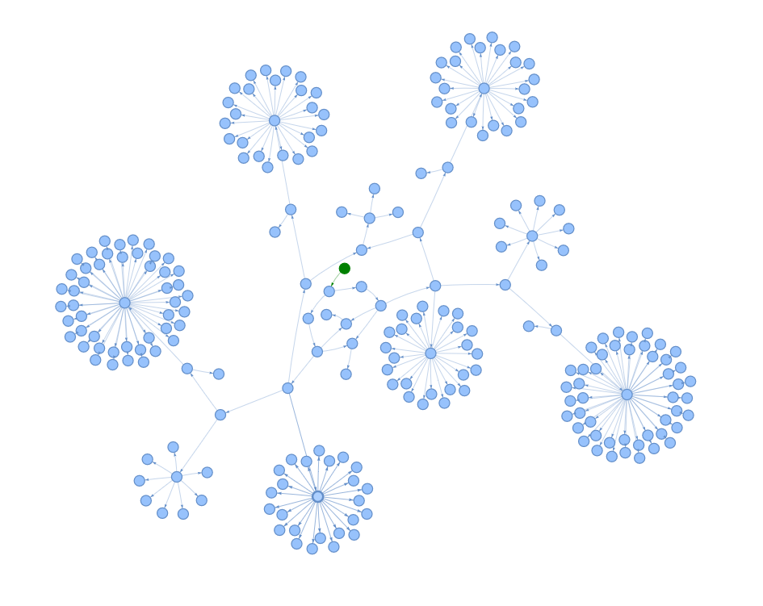
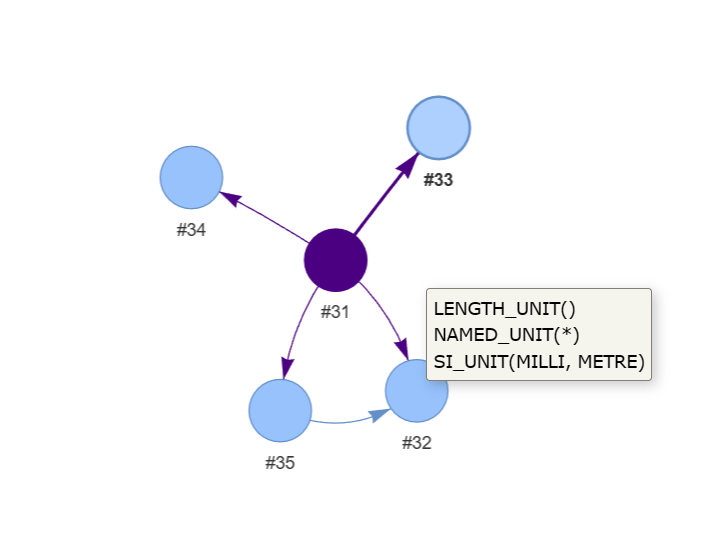

# Introduction
There are a lot of the masterpieces all around us, but there are just some that we can stare at for hours.

Like "Mona Lisa" or "Portrait of the Artist's Mother at the Age of 63" they take us just with a very paint stroke or shade of a pencil.

Among others, for me there are two such masterpieces that inspired me so much, touched me deeply, and drown me in existential reasoning - it is [step-file-parser](https://github.com/IfcOpenShell/step-file-parser) from ifcOpenShell and this [video](https://www.youtube.com/watch?v=Mm-cIUEzKr4).

Leonardo Da Vinci's STEP graph visualization tool or simply **LeDaViS tool** is a rethinking, and I would say a reinvention, of the idea that was been put into step-file-parser - simple yet powerful and still unnoticed visual tool to explore the structure of STEP and IFC files.

"Leonardo Da Vinci's" is just because it is an amazingly simple thing made using the basic functionality of the existing tools, no extra specific or comprehensive dependency for the formats that everybody get used to in the CAD world, but it is more amazing when you catch the question: why didn't we have such a tool 20 years earlier?

The tool is a Python script implemented using Lark parser and Pyvis, pretty straightforward, exemplary, and there is no optimizations of any kind.

Grammar dictionary has been improved a bit to take into account such things as whitespaces in string parameters and some other minor modifications.

The output is the HTML page with interactive graph representing structure of an entire file (almost unusable for the large models) or just a specific entity of the model (almost unusable for a single item).

Graph supports scrolling, panning, dragging of nodes, custom colors of specific entity types, and also capable of showing tooltips containing textual description of the corresponding node. 

# Requirements
Python
~~~
pip install lark-parser
pip install pyvis
~~~

# Usage
To produce graph for the overall structure:
~~~
python LeDaViStool.py sample.step sample.html
~~~

To produce graph for a specific entity of the model:
~~~
python LeDaViStool.py sample.step sample.html 42
~~~

# Sample data
`NOTE! This is not any kind of an advertisement of any resource or organization. The following links are given of the pure academic reasons only.`

Some sample STEP files are available [here](https://www.mbx-if.org/cax/cax_stepLib.php).

Some sample IFC files are available [here](https://openifcmodel.cs.auckland.ac.nz/).

# Acknowledgements
High gratitude to the authors of [step-file-parser](https://github.com/IfcOpenShell/step-file-parser)